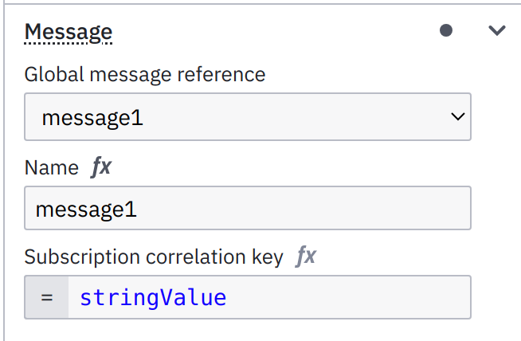

The Correlation API provides functionality to correlate messages with running process instances.
It is intended to be used in outbound adapters of the port/adapter architecture, in order to control
the process engine from your application.

Message correlation denotes the ability of a process engine to continue the process execution of a process instance, waiting in a catch message event,
if a message with a given name is delivered to the process engine. In doing so, it requires a way to target a single process execution (otherwise the
correlation fails regarding BPMN specification).

Different engines provide different notions for targeting a single process execution. We believe that the best way to do so, is not to rely on individual
engine features, but rather should be based on an approach which can be applied in any BPMN engine, either message correlation based on a correlation value,
or supporting scoped variable mapping. In both cases, it is useful to use a value of a process variable as a correlation value.

In case the engine supports correlation value, you just need to define it in your BPMN. Here is an example of doing it in Camunda 8:

{ width="300" }

In case the correlation value is not supported directly, but scoped variable mappings are supported, you need to define a (local) variable
in the scope of the message catch event and provide the correlation value to point to a process variable. Here is an example of doing it in Camunda Platform 7:

{ width="300" }

For this reason, the Message Correlation API supports the targeting based on a `Supplier<Correlation>`.

As a user of the `CorrelationAPI` you have to invoke the `CorrelateMessageCmd` and provide the `Correlation` via supplier function.

And here is the example code to correlate message:

```java
class CorrelationUseCase {

  private final CorrelationApi correlationApi;

  /**
   * Correlates `message1` using supplied value as correlation key. 
   * @param correlationValue correlation value.
   * @param payloadValue value to set as process variable on successful correlation.
   */
  void correlateMessage1(String correlationValue, String payloadValue) {
    correlationApi.correlateMessage(
      new CorrelateMessageCmd(
        "message1",
        () -> Map.of(
          "message-delivered-value", payloadValue
        ),
        () -> Correlation.withKey(correlationValue)
      )
    ).get();
  }
}

```
