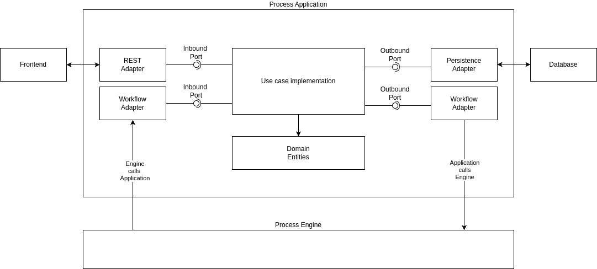

Clean Architecture is a set of principles defined by [Uncle Bob's post back in 2012](https://blog.cleancoder.com/uncle-bob/2012/08/13/the-clean-architecture.html)
and focuses on several rules applied during system design. This principles are originally published in different architectural approaches
and are used combined to achieve some software quality values like:

- Portability (aka independent of frameworks)
- Good Testability
- Independence of external systems

Our experience of building Process Applications showed that the application of Clean Architecture delivers those values to process applications as well.
Considering application of Clean Architecture principle, the architectural blueprint would result in something similar to the following:

There are in general multiple inbound adapters for the application, responsible for initialization of the control flow. A common one is a REST adapter offering
some endpoint for HTTP access of some frontend. There might be many other, like message consumers, but the interesting one in the context of process 
applications is the WorkflowAdapter. Every time, the process orchestration needs to invoke some business functionality of our application, it would
use this to access its implementation of a particular use case. Usually, process engines have some measures and API to register callbacks for this.

On the outbound adapter side, the application relies on different third-party technologies integrated via outbound ports. Following the dependency rule, 
the application code is not allowed to reference any adapters directly. A common practice is to use Dependency Inversion to wirte the adapter implementing
the outbound port, so the use case implementation only has a reference to the outbound port and the IoC container provides the adapter implementation 
at runtime. Again, the part specific to process applications is the integration of the Workflow Adapter, responsible to forwarding of all calls to the 
process engine. Usually, this adapter translates the process-related operations like starting of new process instances or completion of user or service
tasks to a vendor-specific process engine API.

The `Process Engine API` provides vendor-agnostic abstract API for the `Workflow Adapter` and uses a set of adapter modules, translating its invocation
into the vendor-specific API calls. By doing so, your application code remains technology-independent and portable.

